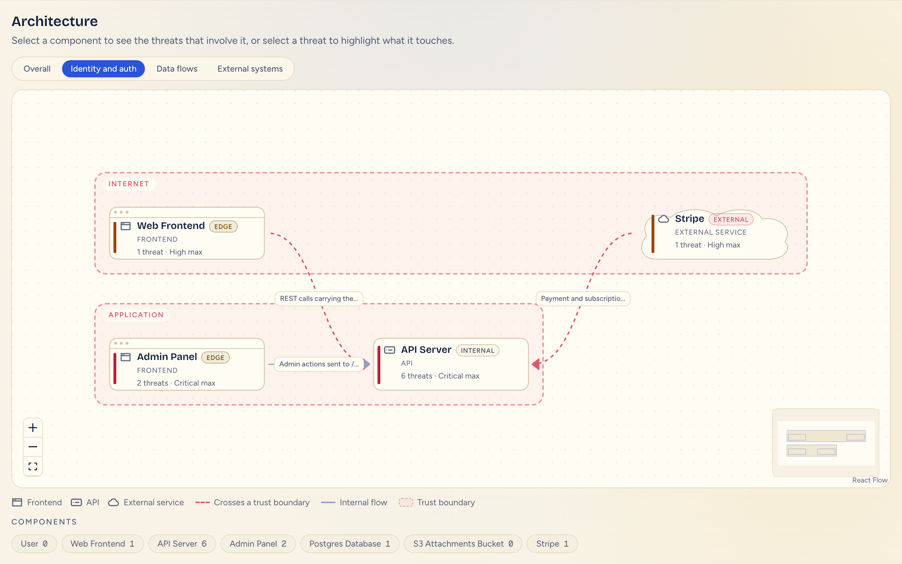
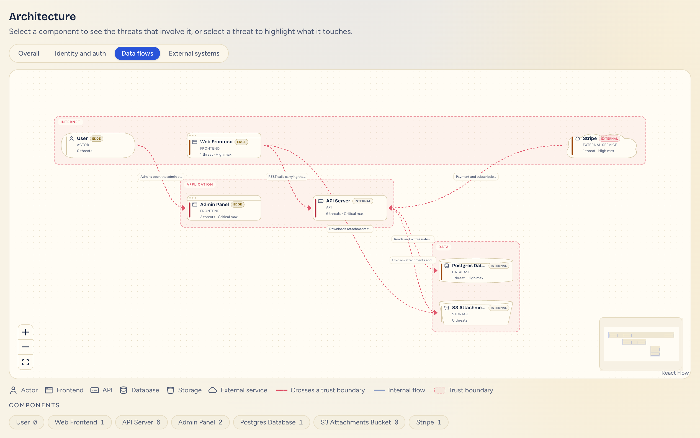
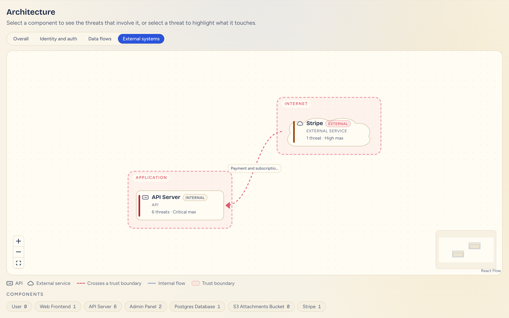

# AttackCanvas

## What it does

You paste a public GitHub repository URL. AttackCanvas reads it without running it, maps its
architecture, and raises STRIDE threats mapped to the OWASP Top 10:2025 and CWE. Each threat
shows its evidence, a confidence computed by code rather than by the model, and whether it
rests on something observed or on a missing control, all on an interactive diagram.

## Demo

Hosted: `<HOSTED_URL>`

**Demo mode works offline.** Set `DEMO_FALLBACK=1` and point `GOLDEN_REPO_URL` at the demo
repository. Submitting that URL then serves a saved threat model instead of running the
pipeline. It needs no GitHub token, no Anthropic key, no Docker and no Semgrep, and it makes
no model call. It still walks the same stages with real delays and pauses for developer
questions, like a live run.

The saved model is `fixtures/demo-analysis.json`, a synthetic application, `acme/acme-notes`.
`fixtures/golden-demo.json` would take its place if present; it does not exist. A saved
NodeGoat result is kept at `fixtures/samples/nodegoat-a3118b6.json`, but nothing serves it,
so a real repository URL never returns a canned result.

```bash
DEMO_FALLBACK=1 GOLDEN_REPO_URL=https://github.com/acme/acme-notes pnpm dev
```

Open http://localhost:3000 and submit `https://github.com/acme/acme-notes`.

Run `pnpm install` once while online (Setup below). Once installed, the demo needs no
network. The fonts come from `next/font/google`, so without a connection `next dev` uses a
fallback system font for any font it has not already downloaded.

| Overall | Identity and auth |
|---|---|
|  |  |
| **Data flows** | **External systems** |
|  |  |

## Setup

Requirements: Node 22 or later, pnpm (through `corepack enable`), Docker for the GitHub MCP
server, and Semgrep CLI 1.176.0. Demo mode needs only Node and pnpm.

```bash
corepack enable
pnpm install
cp .env.example .env.local
```

Fill in `.env.local`. The full table is in [docs/setup.md](docs/setup.md).

| Variable | What it is |
|---|---|
| `ANTHROPIC_API_KEY` | Claude API key. Never logged. |
| `GITHUB_PERSONAL_ACCESS_TOKEN` | Fine-grained token, public read access only, no write scopes. |
| `ATTACKCANVAS_MODEL_PROFILE` | `dev` (default) or `demo`. See Cost. |
| `ATTACKCANVAS_ALLOWED_OWNERS` | Optional comma-separated owner allowlist. Blank allows every owner. |

Pull the pinned GitHub MCP server image and install Semgrep:

```bash
docker pull ghcr.io/github/github-mcp-server:v1.12.2@sha256:508a0857ec762b1ab1cece29193345b501fab1dd9d1228a7b617062954cecac6
pipx install semgrep==1.176.0
semgrep --version
```

`semgrep --version` should print `1.176.0`. The app starts the MCP server itself; you do not
run the container by hand. Then:

```bash
pnpm dev
```

Checks, none of which call a model:

```bash
pnpm typecheck
pnpm test
pnpm lint
pnpm bench
```

`Dockerfile` builds a production image for hosts without Docker-in-Docker. It copies the
same pinned GitHub MCP server binary and installs Semgrep 1.176.0.

## How it works

1. **Load.** The GitHub MCP server (read-only, six allowed tools) fetches the repository tree and files.
2. **Filter and redact.** Files are ranked, capped by count and size, and secrets are redacted before anything else sees them.
3. **Detect.** Deterministic detectors find frameworks, routes, auth, datastores and 13 kinds of missing control.
4. **Scan.** Semgrep (13 of our own rules, via MCP) and OSV (known vulnerabilities in direct npm dependencies) add evidence.
5. **Map the architecture.** Claude drafts components, data flows and trust boundaries, then code reconciles the draft with the detected facts.
6. **Raise threats.** Claude writes STRIDE threats per batch of elements, mapped to OWASP Top 10:2025 and CWE, citing evidence ids.
7. **Score.** Code, never the model, computes severity, confidence, basis and priority (`src/server/scoring`).
8. **Ask and show.** Up to three developer questions refine the scores, and the result opens as an interactive dashboard.

Repository content is data, never instructions. It reaches the model only inside
`<repo_file>` tags, and every model reply is validated with Zod.

## Confirmed findings and predicted risks

Every threat card says which kind it is. A **confirmed finding** (`evidence_backed`) rests on
something a scanner or detector observed in the code: a Semgrep match, a vulnerable dependency,
a detected route or configuration. A **predicted risk** (`assumption_dependent`) rests on a
control that should be present but could not be found, such as an ownership check on a route or
a rate limit on login. It is a prediction from absence, and its confidence is lower.

Predictions matter because some OWASP categories have no vulnerable line to point at: broken
access control (A01), security misconfiguration (A02), vulnerable and outdated components
(A06) and authentication failures (A07) are often a missing check, not a bad one. The gaps come
from deterministic detector code, not from the model, so text in the repository cannot argue
them away.

**Gap precision on NodeGoat: 39/39 rows (15/15 visible).** Read this with care: the 39 rows
represent only **four distinct gap claims** in **one intentionally vulnerable repository**, where
each control is missing by design. It is not evidence that gap predictions are generally 100%
accurate. The seeded benchmark, where controls are planted so the detectors can be wrong, found
1 false gap in 17 planted controls (5.9%). See [docs/evaluation.md](docs/evaluation.md).

## Evaluation

From [docs/evaluation.md](docs/evaluation.md). All runs are OWASP NodeGoat at `c5cb68a`,
level 2, demo profile, labelled by hand against the pinned source.

| run | threats | visible | recall | visible recall | unsupported | visible unsupported | evidence acc |
|---|---|---|---|---|---|---|---|
| after-fix (corrected) | 109 | 11 | 12/19 | 4/19 | 23/109 | 3/11 | 87/111 |
| c8dd73f | 118 | 16 | 16/19 | 7/19 | 28/118 | 3/16 | 97/117 |
| 7a0fb27 | 98 | 35 | 13/19 | 8/19 | 23/98 | 10/35 | 92/102 |
| f64cfa8 | 89 | 24 | 14/19 | 7/19 | 25/89 | 4/24 | 93/105 |
| **a3118b6** | 136 | 37 | **17/19** | **10/19** | 32/136 | **4/37** | 127/146 |

NodeGoat documents its own vulnerabilities in files the model reads, so its recall is guided,
not blind discovery. The a3118b6 run still misses NG-WEAK-PASSWORD-POLICY and NG-VULNERABLE-DEPS.

**Seeded benchmark** (three repositories with planted issues and controls, no model, from
`eval/bench/report.md` at `1d3237a`):

| Mode | TP/FP/FN | Precision | Recall | False-gap rate | Deterministic |
| --- | --- | ---: | ---: | ---: | --- |
| detectors | 15/1/0 | 93.8% | 100.0% | 1/17 (5.9%) | yes |
| detectors+semgrep | 18/1/0 | 94.7% | 100.0% | 1/17 (5.9%) | yes |

The seeded apps were written with the detectors in view, so 100% recall is an upper bound.

**Labeller agreement.** A second labeller, a separate blind model session rather than a
person, labelled a stratified sample of n = 20 a3118b6 threats. It agreed on `supported` for
16/20 (80.0%), Cohen's kappa 0.47, and on the exact `evidenceCorrect` cell for 17/20 (85.0%).
All four disagreements are listed in docs/evaluation.md.

**Run-to-run consistency has not yet been measured.** A three-run check at level 2 is
planned. What is fixed and what varies between runs is described in
[docs/reproducibility.md](docs/reproducibility.md).

**Tests.** 100 test files, 3,954 tests (3,953 passed, 1 skipped: a live test that needs an
API key). Coverage over `src/`: 96.05% statements, 89.53% branches, 94.83% functions, 96.85%
lines. Both figures were measured on `final-sprint` after the lint fixes; see [docs/testing.md](docs/testing.md).

## Cost

From [docs/cost.md](docs/cost.md). All figures are Claude API usage at list price for a
NodeGoat-sized repository. Larger repositories cost more. The level picker shows the "Shown
range" column. Measured and estimated figures are kept apart: only level 2 has been measured.

| Level | Models (demo) | What changes | Shown range | Measured | Estimated |
|---|---|---|---|---|---|
| 0 Snapshot | Sonnet 5 | context 20,000, at most 3 STRIDE batches, no questions | $0.30 to $0.60 | not yet measured | $0.30 to $0.60 |
| 1 Basic | Sonnet 5, Haiku on classify | same budgets as level 2 | $1 to $1.50 | not yet measured | $1.10 to $1.60 |
| 2 Standard | Opus 5 on architecture and STRIDE | today's demo profile | $3 to $4 | $2.84 to $4.07 | — |
| 3 Deep | as level 2 | architecture context 90,000 | $3.50 to $5 | — | $3.20 to $4.60 |
| 4 Exhaustive | as level 2 | level 3 plus adaptive thinking on STRIDE, output budget 16,000 | $4 to $6 | — | $3.50 to $5.90 |

Level 2's measured range comes from six NodeGoat runs (mean $3.37). With
`ATTACKCANVAS_MODEL_PROFILE=dev`, or unset, every level runs on the cheaper dev models.

## Diagram

- **Entity types.** Actor, frontend, backend, API, database, storage, external service, auth
  provider, worker and queue, each with its own icon.
- **Trust boundaries.** Boundaries are drawn as dashed groups around their components. A
  flow that crosses one has a dashed edge.
- **Four views.** Overall, Identity and auth (OWASP A01 and A07, STRIDE Spoofing and
  Elevation of privilege), Data flows, and External systems. A view changes only the
  diagram, never the threat list.
- **Exposure badge.** Each component is marked External (someone else runs it), Edge (it
  takes input from outside) or Internal (reachable only through another component). The
  badge describes a component; it never changes a score.

## Working with findings

- **Status.** Mark a finding Open, Fixed, Accepted risk or False positive. A status is your
  own triage note and never changes severity, confidence or priority.
- **Issue links.** Each finding can open a pre-filled GitHub issue (title, evidence, severity,
  confidence and basis) in the analysed repository. You review and submit it; nothing is
  created for you. A finding too long for a link offers "Copy as Markdown" instead.
- **Drift.** "Since last run" compares this analysis with the previous one of the same
  repository and marks components, flows and threats that were added or removed.

Status and drift history are stored **per browser**, in `localStorage`. Nothing is saved on
a server, so another browser, device or teammate does not see them.

## Coverage and limits

What each OWASP Top 10:2025 category can be evidenced by, and what the tool cannot see:
[docs/coverage.md](docs/coverage.md). Known weaknesses of the detectors and the security
review: [docs/known-limitations.md](docs/known-limitations.md).

## Security of the tool itself

The threat model of AttackCanvas itself covers prompt injection, secret leakage, MCP tool
surface and cost abuse, with the control and the test for each:
[docs/security-design.md](docs/security-design.md).

## Coming soon

- **Incremental scans.** The first scan reads the whole repository; later scans re-check only changed files and components.
- **Full scan or change scan.** The user picks a complete analysis or a cheaper review of what changed.
- **Scans triggered by Git activity.** Automatic scans on merge to main, with optional scans per commit and per pull request.
- **Targeted branch scans.** Scans of non-main branches only when they touch identity, database, encryption or network code.
- **Scoring external dependencies by access.** Severity that reflects what data and access a third-party component has.
- **One-click GitHub issues.** Today the tool pre-fills the issue and you submit it; later it can create it directly with a scoped token.
- **Shared finding history.** Status and drift are saved in your browser today; later they sync across devices and teammates.
- **More benchmark apps.** OWASP Juice Shop and DVWA alongside NodeGoat and the seeded repositories.
- **Local models for cheap steps.** Classification and question drafting on a local model, keeping Claude for the heavy reasoning.

## Repository layout

```
src/app/            Next.js pages and API routes (/api/analyze)
src/components/     React components: dashboard, diagram, threat cards
src/client/         Pure client logic: view model, diagram views, drift, status, issue links
src/server/ingest/  Repository loading, filtering and caps
src/server/mcp/     GitHub and Semgrep MCP clients (allowlist, timeouts, size caps)
src/server/detect/  Deterministic detectors and the 13 gap kinds
src/server/scanners/ Semgrep normalisation and OSV
src/server/analysis/ Pipeline, architecture, threats, assembly
src/server/ai/      Claude calls, model profiles, level plans
src/server/scoring/ Severity, confidence, basis and priority
src/server/security/ Redaction, injection handling
src/shared/         The schema contract (src/shared/schema), labels, roadmap
prompts/            Versioned model prompts
fixtures/           Demo and sample threat models
eval/               Answer keys, labels, results, reviews, seeded bench report
scripts/            Try scripts and the evaluation runner
tests/              Vitest suites and fixtures, including the seeded repositories
docs/               Setup, security design, evaluation, cost, coverage, limits
```

See [CLAUDE.md](CLAUDE.md) for the engineering rules.
