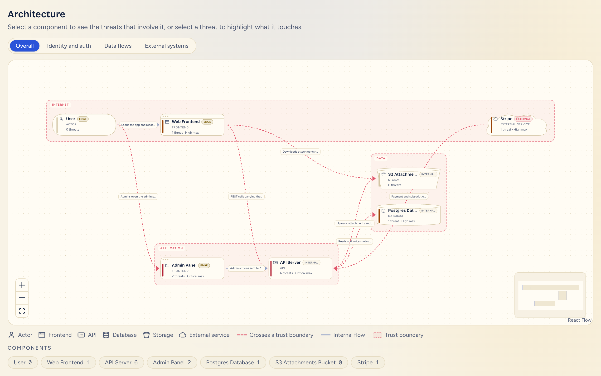

# AttackCanvas
https://youtu.be/OvXUEcqchVY?si=Y8fg_BZrGzPMwaOb 
**Paste a public GitHub URL, get an evidence-backed STRIDE threat model in minutes.**
AttackCanvas reads a repository without running it. It maps the architecture and finds
missing security controls. Each threat is scored by code, not by the model, so every
score can be audited.

**Live demo:** https://attackcanvas.onrender.com
The first load after idle can take about a minute. Levels 0 to 3 are open; level 4 is
switched off on the hosted demo to cap cost.



## Who it is for

- **Developers:** what to fix first, with the file, the line and a mitigation.
- **Security engineers:** components, data flows, trust boundaries and triage.

## Why it exists

Threat modelling catches architectural flaws, but it is slow and expert-dependent, so most
teams skip it. Code scanners flag risky lines, but the worst problems are often something
**missing**: an ownership check, CSRF protection, a rate limit. A missing control has no
line to flag.

| Approach | Limitation |
|---|---|
| Snyk, Checkmarx, CodeQL | Pattern-level scanning, no architecture reasoning |
| "Paste your code into a chatbot" | No evidence grounding, no scoring |
| Manual STRIDE workshops | Accurate, but slow, expensive and expert-dependent |
| **AttackCanvas** | Architecture from code, missing-control detection, code-computed scores, about $3 a run |

## How it works

1. **Load.** The GitHub MCP server fetches the files read-only, with 6 allowlisted tools.
   It keeps the top 300 files / 2 MB, ranked by security relevance.
2. **Redact.** Secrets are removed before anything else sees them. Repository text is data,
   never instructions.
3. **Detect.** Deterministic detectors find frameworks, routes, auth and datastores, plus 13
   kinds of missing control.
4. **Scan.** Semgrep (13 custom rules, via MCP) and OSV (known CVEs in npm dependencies) add
   evidence.
5. **Model.** Claude maps the components, flows and trust boundaries. It then writes STRIDE
   threats mapped to OWASP Top 10:2025 and CWE, each citing evidence.
6. **Score.** Code, never the model, computes severity, confidence, basis and priority
   (`src/server/scoring`).
7. **Ask.** Up to 3 developer questions refine the confidence scores.
8. **Show.** An interactive diagram and a prioritised threat list (Fix now / Fix soon /
   Monitor).

## Scoring

- **Risk** = impact × likelihood, each 1 to 5. The bands are Critical 20–25, High 12–19,
  Medium 6–11 and Low 1–5.
- **Confidence** (0 to 1) is a sum of evidence points:

  | Evidence | Points |
  |---|---|
  | Code evidence | +0.35 |
  | OSV advisory | +0.30 |
  | Developer answer | +0.30 |
  | Missing control | +0.30 × certainty |
  | Semgrep match | +0.25 |
  | Second independent source | +0.10 |
  | Inference only | +0.20 |
  | Unconfirmed assumption | −0.15 |

  Evidence at the same file and line counts once.
- **Fix now** means Critical, or High with confidence of at least 0.50.
- **Basis:** every threat is either **Confirmed** (a scanner or detector saw it) or
  **Predicted** (a control is missing).
- **Below 25% confidence:** the threat is still listed, but last and greyed, marked
  "unverified, review before acting". It never enters Fix now.

## Features

| View | What it shows |
|---|---|
| Overall | The whole system |
| Identity and auth | Authentication and identity components |
| Data flows | How data moves between components |
| External systems | Third-party services and providers |

- Trust boundaries are drawn as dashed groups, and flows that cross one are dashed.
- Each entity type has its own icon. An exposure badge marks each component External, Edge
  or Internal.
- The threat list filters by severity, confidence, priority, basis, STRIDE, OWASP,
  component and status.
- Each finding shows its attack scenario, evidence at file and line, CWE and OWASP tags,
  the reasons for its confidence, and a mitigation.
- A pre-filled GitHub issue per finding: you review and submit it.
- **Triage status** (Open, Fixed, Accepted risk, False positive). A status is saved against
  the threat's title, components and OWASP categories, so it follows the same threat to the
  next run.
- **Since last run** shows how many threats are new and how many were not found again.
  "Not found" never means fixed; only a status you set says that.
- Status and history are stored in your browser (`localStorage`), not on a server.
- Five analysis levels trade depth for cost:

  | Level | Cost per run |
  |---|---|
  | 0 Snapshot | $0.30–$0.60 |
  | 1 Basic | $1–$1.50 |
  | 2 Standard | $3–$4 |
  | 3 Deep | $3.50–$5 |
  | 4 Exhaustive | $4–$6 |

## Security of the tool itself

AttackCanvas assumes the repository it reads may be hostile.

- **Prompt injection.** Repository content is wrapped and escaped. A security preamble
  heads every system prompt. The model calls that reason about the code have no tools
  attached. Injection-like text becomes evidence, and the model's output is checked
  afterwards.
- **Gap suppression.** Missing controls come from deterministic code, so a README saying
  "auth is handled by our gateway" cannot remove the finding. A canary test proves the
  output is byte-identical.
- **Secrets.** Secrets are redacted before any model call, checked again at every boundary,
  and never logged.
- **Abuse.** There is a limit of 5 analyses per hour per IP and 2 at once, and an optional
  owner allowlist. MCP tools are allowlisted, and the MCP image is pinned by digest.

Details: [docs/security-design.md](docs/security-design.md).

## Results

All runs use OWASP NodeGoat at a pinned commit, level 2, labelled by hand against the source:

| Measure | Result |
|---|---|
| Recall of known vulnerabilities | 17 of 19 (89.5%) |
| Recall at 25% confidence or above | 10 of 19 |
| Threats at 25%+ that were wrong | 4 of 37 (11%) |
| Evidence accuracy | 127 of 146 (87%) |
| Second labeller agreement | 16 of 20 (80%), Cohen's kappa 0.47 |
| Seeded benchmark (3 apps, no model) | 15 TP / 1 FP / 0 FN; 1 false gap in 17 planted controls |
| Cost, level 2 (6 runs) | $2.84–$4.07, mean $3.37 |
| Tests | ~3,950 passing, 96% statement coverage |

**Caveats:**
- NodeGoat documents its own bugs, so its recall is guided.
- The seeded apps were written with the detectors in view, so 100% recall there is an
  upper bound.
- Run-to-run consistency has not been measured yet.

See [docs/evaluation.md](docs/evaluation.md) and [docs/cost.md](docs/cost.md).

## Limits

- The deterministic detectors and Semgrep rules read JavaScript and TypeScript only, and
  OSV checks npm only. On other languages (tested on Java with AltoroJ), the architecture
  maps correctly, but findings rest on the model alone and stay low-confidence.
- Only public repositories are supported. Runtime configuration and infrastructure outside
  the repository are never seen.
- Model output varies between runs. Detectors, scoring and ordering do not.

More: [docs/coverage.md](docs/coverage.md) and
[docs/known-limitations.md](docs/known-limitations.md).

## Run it locally

Requirements: Node 22+, pnpm (`corepack enable`), Docker (for the GitHub MCP server) and
Semgrep 1.176.0.

```bash
pnpm install
cp .env.example .env.local   # set ANTHROPIC_API_KEY and GITHUB_PERSONAL_ACCESS_TOKEN
docker pull ghcr.io/github/github-mcp-server:v1.12.2@sha256:508a0857ec762b1ab1cece29193345b501fab1dd9d1228a7b617062954cecac6
pipx install semgrep==1.176.0
pnpm dev
```

**Offline demo** (no keys, no Docker, no model calls; it serves a saved synthetic result):

```bash
DEMO_FALLBACK=1 GOLDEN_REPO_URL=https://github.com/acme/acme-notes pnpm dev
```

Then open http://localhost:3000 and submit `https://github.com/acme/acme-notes`.

**Checks** (none of them call a model):

```bash
pnpm typecheck && pnpm test && pnpm lint && pnpm bench
```

Full setup is in [docs/setup.md](docs/setup.md).

## Stack

- Next.js (App Router), strict TypeScript, React Flow and Tailwind.
- The Claude API: Opus 5 for architecture and STRIDE, Sonnet 5 for questions, Haiku 4.5
  for classification.
- The GitHub MCP server, the Semgrep MCP server and the OSV API.
- Zod, to validate every model response.
- Vitest for the tests.
- Docker, deployed on Render.

## Coming soon

- **Incremental scans.** The first scan reads the whole repository; later scans re-check only changed files and components.
- **Full scan or change scan.** The user picks a complete analysis or a cheaper review of what changed.
- **Scans triggered by Git activity.** Automatic scans on merge to main, with optional scans per commit and per pull request.
- **Targeted branch scans.** Scans of non-main branches only when they touch identity, database, encryption or network code.
- **Scoring external dependencies by access.** Severity that reflects what data and access a third-party component has.
- **One-click GitHub issues.** Today the tool pre-fills the issue and you submit it; later it can create it directly with a scoped token.
- **Shared finding history.** Status and drift are saved in your browser today; later they sync across devices and teammates.
- **More benchmark apps.** OWASP Juice Shop and DVWA alongside NodeGoat and the seeded repositories.
- **Local models for cheap steps.** Classification and question drafting on a local model, keeping Claude for the heavy reasoning.

## Repository layout

```
src/app/             Pages and API routes
src/components/      Dashboard, diagram, threat cards
src/client/          View model, diagram views, drift, status, issue links
src/server/ingest/   Loading, filtering, caps
src/server/mcp/      GitHub and Semgrep MCP clients
src/server/detect/   Deterministic detectors and the 13 gap kinds
src/server/scanners/ Semgrep normalisation, OSV
src/server/analysis/ Pipeline, architecture, threats, assembly
src/server/ai/       Claude calls, model profiles, levels
src/server/scoring/  Severity, confidence, basis, priority
src/server/security/ Redaction and injection handling
src/shared/schema/   The ThreatModel contract
prompts/  eval/  tests/  docs/
```

Engineering rules: [CLAUDE.md](CLAUDE.md).

Built by Tejaswi Erattu Taj and Jasnoor Chimni for AI Defense Lab 2026, Track 3.
